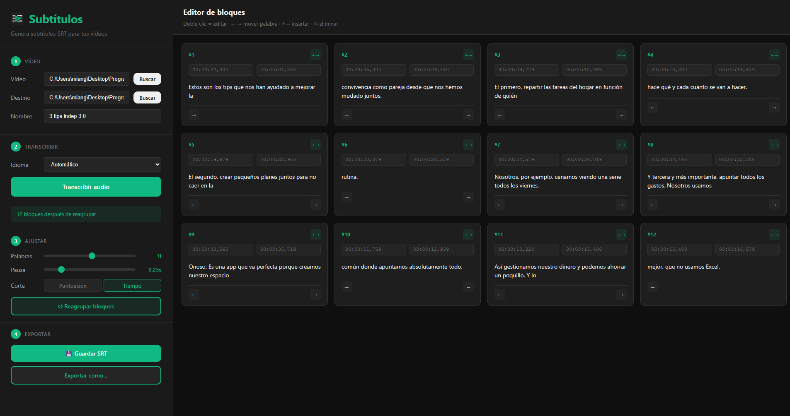

# Subtítulos Automáticos

Genera subtítulos en formato SRT para tus vídeos usando inteligencia artificial. Transcribe el audio automáticamente, edita los bloques visualmente y exporta listos para importar en CapCut, Premiere o cualquier editor.



## Características

- **Transcripción automática** con OpenAI Whisper (modelo turbo)
- **Editor visual** de bloques con edición inline
- **Corte inteligente** por tiempo de pausa o por puntuación
- **Ajuste de palabras** por subtítulo (slider de 1 a 20)
- **Mover palabras** entre bloques con un clic
- **Insertar/eliminar** bloques manualmente
- **Multiidioma**: Español, Gallego, Inglés o detección automática
- **Exportación SRT** compatible con cualquier editor de vídeo
- **App nativa** con Tauri (ligera, rápida, sin Electron)

## Descarga

Ve a [Releases](https://github.com/miguelgoyanes/subtitulos-ai/releases) y descarga el instalador para tu sistema:

| Plataforma | Archivo |
|---|---|
| Windows | `.exe` (instalador NSIS) |
| macOS | `.dmg` |
| Linux | `.deb` / `.AppImage` |

## Requisitos previos

Antes de usar la app necesitas instalar:

### 1. Python + Whisper

```bash
pip install openai-whisper
```

La primera vez que transcribas se descargará el modelo turbo (~800 MB). Las siguientes veces será instantáneo.

### 2. ffmpeg

**Windows:**
```bash
winget install ffmpeg
```

**macOS:**
```bash
brew install ffmpeg
```

**Linux (Ubuntu/Debian):**
```bash
sudo apt install ffmpeg
```

## Uso

1. **Abre la app** y selecciona tu vídeo (MP4, MOV, AVI, MKV, WEBM)
2. Elige el **idioma** del vídeo (o déjalo en automático)
3. Pulsa **Transcribir audio** y espera
4. **Ajusta los bloques** en el editor:
   - **Doble clic** en un bloque para editar el texto
   - **← →** para mover palabras entre bloques
   - **+→** para insertar un bloque nuevo
   - **✕** para eliminar bloques vacíos
5. Configura los parámetros de corte:
   - **Palabras**: máximo por subtítulo (1-20)
   - **Pausa**: umbral de silencio para cortar (0.1s - 1.0s)
   - **Corte**: elige entre "Tiempo" (corta por pausas de voz) o "Puntuación" (corta por signos `.,;!?`)
6. Pulsa **Reagrupar bloques** para aplicar los cambios
7. **Guarda** el archivo SRT

## Importar en CapCut

1. Abre tu proyecto en CapCut
2. Ve a **Texto → Subtítulos → Importar subtítulos**
3. Selecciona el archivo `.srt` generado
4. Ajusta estilo, fuente y posición desde el panel derecho

## Desarrollo

### Requisitos

- **Node.js** 18+
- **Rust** ([rustup.rs](https://rustup.rs/))
- **Python** con `openai-whisper`
- **ffmpeg**

### Instalar

```bash
git clone https://github.com/miguelgoyanes/subtitulos-ai.git
cd subtitulos-ai
npm install
```

### Modo desarrollo

```bash
npm run tauri dev
```

### Compilar

```bash
npm run tauri build
```

El ejecutable se genera en `src-tauri/target/release/bundle/`.

## Stack

| Capa | Tecnología |
|---|---|
| Frontend | React + Vite |
| Backend | Tauri (Rust) |
| Transcripción | OpenAI Whisper (Python) |
| Empaquetado | GitHub Actions (multiplataforma) |

## Licencia

MIT
